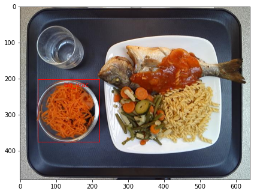

# FasterRCNN
Give a try to Faster RCNN with a little challenge.

# Challenge : Detection and classification of cold starters

The goal of this challenge is to provide a function detect_and_classify_vrac(im_path) that takes as an input an image and detects (via bbox) and classifies an element of “salad & fruit bar”.  

For this goal, we can use a training dataset:
- 1000 images  
- For each image one or more bounding boxes [xmin, ymin, width, height] and the associated classification (​small_vrac​ or big_vrac).

I developed a system using Faster-RCNN, all code is explained in the Notebook: FasterRCNN.ipynb

# Used Libraries

[keras-frcnn](https://github.com/kbardool/keras-frcnn)
[Object-Detection-Metrics](https://github.com/quentindubourgdeluzencon/Object-Detection-Metrics)
Thanks to them!!

# Contributors

